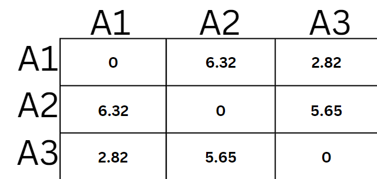

```{r setup, include=FALSE, warning=FALSE}
knitr::opts_chunk$set(echo = TRUE, warning = FALSE)
```


## 1.0 Student*innen-Fragen

### 1.1 Bei der "dist()" methode, was genau ist der output? Verstehe, dass es die Distanzen der einzelnen Punkte zueinander sind und das diese dann für das Clustering genutzt werden, aber nicht was genau die row und column bedeuten
Die Funktion "dist()" berechnet in R die Distanzen zwischen den Punkten und speichert diese in einer Matrix ab. Die Disanz hängt dabei von der gewählten Berechnungsmethode (z. B. Euclidean) ab. Die Matrix zeigt dann jeweils die Distanzen zu den jewiligen Punkten. Da die Distanz von Punkt A zu Punkt B gleich gross ist wie von Punkt B zu Punkt A, wird die Matrix aus Performanzgründen nicht komplett gefüllt. Die folgende Grafik soll dies zusätzlich veranschaulichen.




### 1.2 Dendrogram Aussage auf Foliensatz 13 etwas unklar
Bei einem Dendrogram sind die Achsen wie folgt:

* Y-Achse: Distanzen der Datenpunkte. Falls sich also tiefer unten ein Cluster bildet, bedeutet das, dass die zwei Cluster eine kleine Distanz haben, weiter oben eine grosse. 
* X-Achse: Das sind die einzelnen Datenpunkte

Die Aussage ist nun, dass Cluster die sehr weit unten fusioniert wurden, wahrscheinlich nicht aussagekräftig genug sind.
Dies ist so, weil es wahrscheinlich noch weitere Datenpunkte gibt die zu diesem Datenpunkt gehören. 
Der Cluster ist also "noch nicht abgeschlossen". Falls es aber nun einen grossen Abstand auf
der Y-Achse vom letzten und jetzigen fusionierten Cluster gibt, spricht das dafür, dass dieser
Cluster aussagekräftig ist und die Struktur der Daten gut beschreibt. Dies ist so weil der
grosse Abstand darauf hindeutet, dass es einen grossen Abstand zwischen den Clustern gibt und
diese nicht fusioniert werden sollten.

Wie würde man dieses Dendrogram nun analysieren:

Zuerst einmal sieht man, dass es weiter unten sehr viele, sehr nach zueinander 
stehende Fusionen gibt. Im ganzen blauen Bereich würde ich also sicher nicht 
"den Baum schneiden". Diese Cluster sagen einfach zu wenig über die Struktur der
Daten aus (Y-Achsen Distanzen zu klein). Über dem Blauen Bereich sieht man nun, dass
die Distanzen von Fusion zu Fusion grösser werden. Ein idealer Punkt meiner Meinung
nach wäre damit die Rote Linie. Dort sind die Distanzen viel grösser und die
Cluster sagen wahrscheinlich viel über die Struktur aus. Den Punkt 49 würde
ich als streichen und als "Ausreisser" markieren, da er nicht ins sonstige Bild
der Daten passt.

```{r}
cars.dist=dist(cars, method = "minkowski")
cars.hclust = hclust(cars.dist) # default: complete Linkage
plot(cars.hclust, hang=-1, cex=.7 ) # hang und cex dienen zur besseren Lesbarkeit.
rect.hclust(cars.hclust, k=3, border="red")
rect.hclust(cars.hclust, k=7, border="blue")
```


### 1.3 Wie interpretiert man den "silhouette" command?


Der Silhoette command in R gibt an, wie gut ein Punkt zu seinem Cluster passt im vergleich zum nächstgelegensten Cluster.
Der Output sind Werte von -1 bis 1. 
Im Bild oben ist:

* "o" der Datenpunkt den wir untersuchen
* "A" der Cluster in dem sich "o" momentan befindet
* "B" der Cluster der neben "o" am nächsten ist ("A" wird ignoriert)

Der Wert wird nun so berechnet, dass die Differenz des Abstands von (A,o) und (B,o) berechnet wird 
und dieser gewichtet wird mit dem maximalen Abstand von (A,o) und (B,o).

Dabei sprechen positive Werte (möglichst nahe bei 1) dafür, dass der Punkt "o" gut zu seinem momentanigen Cluster passt
und negative Werte (nahe bei -1), dass er schlecht zu seinem momentanigen Cluster passt und wahrschinlich dem falschen Cluster zugeordnet ist. 
Ein neutraler Wert von 0 bedeutet, dass er eigentlich zu keinem der Cluster passt. Man spricht von einem
starken Zusammenhang (ob positiv oder negativ ist egal) ab einem Wert von über | 0.75 |.

Im Output von R kann man gut sehen, dass zumindest die ersten 10 Werte des Clusters 1 sehr
gut zum Cluster 1 passen im Vergleich zum nächsten Cluster 2. Man kann also davon ausgehen, dass
sich diese Punkte im richtigen Cluster befinden.
```{r}
library(cluster)
bike <- read.csv("bike.csv", stringsAsFactors = FALSE)
bike.dist <- dist(bike[,c("temp", "casual", "registered", "windspeed")])
bike.clust <- hclust(bike.dist)
sil <- silhouette(cutree(bike.clust, 3), dist = bike.dist)
head(sil, 10)
```


# 2.0 Hausaufgaben

### 2.1 Beschreiben Sie in eigenen Worten, wie die Linkage-Varianten auf der Folie 10 jeweils funktionieren


Der Clustering Prozess ist iterativ und in jedem Schritt werden die zwei Cluster fusioniert, 
welche die geringste Distanz zueinander aufweisen.
Diese Linkage-Verfahren bestimmen nun, wie die "Distanz" zwischen zwei Clustern definiert wird:

* **Single Linkage**: (nächst gelegener Nachbar): Die Distanz zwischen zwei Clustern ist die Distanz der zwei nächst gelegenen Punkten eines Clusters.
Für die Definition der Distanz werden also einfach die zwei nächsten Punkte genommen.
Diese Methode hat einen entscheidenden Nachteil: Es kann schnell passieren, dass
zwei Cluster fusioniert werden, die eigentlich nur zwei zueinander nahe Punkte haben,
die restlichen Punkte aber weit voneinander entfernt sind. Dies nennt man dann
"Kettenform" und das wird im nächsten Abschnitt noch einmal erklärt.

* **Sinlge Linkage** (Kettenform): Nicht eine neue Linkage Methode. Zeigt aber genau das Problem auf, dass die Cluster eigentlich nicht zusammengehören aber aufgrund einer "Kette" nun ein cluster sind. Der Cluster
ganz links und unten rechts gehören eigentlich nicht zusammen, aber durch den Punkt
zwischen den beiden werden sie trotzdem fusioniert.

* **Complete Linkage**: (entferntester Nachbar): Die Distanz zwischen zwei Clustern ist die Distanz der zwei am weitesten entfernten Mitglieder. Dies verhindert das Problem der "Kettenbildung", führt aber ein anderes Problem ein. 
Ausreisser können dazu führen, dass Cluster fälschlicherweise fusioniert werden.

* **Average Linkage**: Die Distanz zwischen zwei Clustern ist der Durschnitt aller Distanzen von allen Punkten in den beiden Clustern.

* **Centroid Linkage**: Distanz zwischen Clustern ist die Distanz ihrer centroide (center of gravity or mean point). 
Dies ist in der Umsetzung dann relativ ähnlich zum "Average Linkage".

* **Ward Linkage**: Ziel ist es Cluster zu haben mit einer minimierten "within-cluser variance". Die Methode sucht also die zwei Cluster, die beim Fusionieren zur kleinsten Vergrösserung der "sum of squared estimate of errors (SSE)" führt.
Diese Methode ist besonders wertvoll, da man in der Statistik mit der Varianz oft sehr viel aussagen treffen kann.

In R kann man die Linkage Methode wie folgt auswählen. Der Standard ist "complete":
```{r}
iris.features <- iris[,1:4]
iris.dist = dist(iris.features, method="euclidean")
# Möglichkeiten sind: "ward.D", "ward.D2", "single", "complete", "average" (= UPGMA), "mcquitty" (= WPGMA), "median" (= WPGMC) or "centroid"
iris.hclust = hclust(iris.dist, method = "complete")
```

### 2.2 Führen Sie das hierarchische Clustering für den Iris-Datensatz durch und interpretieren Sie das Ergebnis anhand eines Dendogramms
Für diese Erklärung werde ich mich an [das Video aus den Folien](https://www.youtube.com/watch?v=q8G6iuZOWUw) halten und dieses erweitern.

Wir verwenden bekannten den Iris-Datensatz. Dieser ist für uns besonders praktisch, da
wir ja schon wissen welche Cluster eigentlich generiert werden sollten. Idealerweise
sollte unsere Clusteranalyse ein Resultat von 3 Cluster für die jeweiligen Spezies haben.

Als erstes schauen wir uns den Datensatz mal noch etwas an. Wir sehen, 
dass wir 4 stetige Variablen haben und einen Faktor (Spezies). Auch sehen wir, dass
die Werte von den einzelnen Columns ziemlich unterschiedlich sind in ihrer Grössenordnung. 
ZB sieht man Petal.Width hat einen Durchschnitt von 1.2 und Sepal.Length einen von 5.8.
Diese Unterschiede könnten unser Clustering verzerren, da die Unterschiedlichen
Grössenordnungen einen direkten Einfluss auf die Distanz haben. Deshalb werden wir unsere
Daten noch skalieren. Auch werden wir den Faktor Spezies rausfiltern, da man mit diesem
nicht eine Cluster-Analyse durchführen kann:
```{r}
summary(iris)

iris_filtered <- iris[,1:4]
iris_filtered <- scale(iris_filtered)

summary(iris_filtered)
```

Nun führen wir die Cluster-Analyse durch mit der Ward-Methode für das Linkage 
Verfahren und der euklidischen Distanz für die Distanzmessung. Anschliessend erstellen
wir das Dendrogram:
```{r}
# Hier berechnen wir die Distanzen der Datenpunkte
iris_filtered_distances <- dist(iris_filtered, method = "euclidean")
# Hier führen wir das eigentliche Clustering druch
iris.filtered_clustering <- hclust(iris_filtered_distances, method="ward.D2")
# Hier erstellen wir das Dendrogram. Hang und Cex sollen den Output schöner aussehen lassen, aber mit vielen Datenpunkten ist das leider schwer.
plot(iris.filtered_clustering, hang=-1, labels=iris$Species, cex=.7)
rect.hclust(iris.filtered_clustering, k=3, border="red")
```

Das Dendrogram zeigt gut, dass es einen sehr schönen Cluster ganz links gibt. Dieser beinhaltet
nur Datenpunkte einer einzigen Spezies. Bei den anderen zwei Clustern ist die Auftrennung
leider nicht mehr so schön. Mit unserem Vorwissen, dass es 3 Spezies gibt, trennen wir 
trotzdem mal nach 3 Clustern auf und analysieren das Ergebnis

Man sieht bei der Analyse der Mittelwerte von Sepal.Length, dass die Cluster klare 
Unterschiede zueinander haben. Cluster 1 hat die tiefsten und 3 die höchsten Werte.

Wenn wir jetzt abgleichen mit der Spezies, sehen wir, dass der Cluster 1 fast nur 
aus Setosa besteht. Dieser Cluster ist also sehr gut gelungen. Auch Cluster zwei ist 
gut und besteht nur aus Versicolor. Cluster 3 scheint aber nicht so gut zu sein und hat
einen Mix aus Versicolor und Virginica.
```{r}
library(dplyr)
# Dendrogram bei 3 Clustern "schneiden"
groups.3 <- cutree(iris.filtered_clustering, 3)
# Sepal.Length anschauen
iris_with_clust <- cbind(iris, groups.3)
iris_with_clust %>% group_by(groups.3) %>%
  summarise(
    Mean = mean(Sepal.Length),
    Median = median(Sepal.Length),
    Min = min(Sepal.Length),
    Max = max(Sepal.Length)
  )
# Gruppen vergleichen
table(groups.3, iris$Species)
```

### 2.3 Führen Sie das kmeans-Clustering für den Iris-Datensatz durch

```{r}
# Lade den Iris-Datensatz
data(iris)

# Setze einen Seed für reproduzierbare Ergebnisse
set.seed(123) 

# Entferne die Spezies
iris_data <- iris[, -5]

# Führe K-Means-Clustering mit 3 Clustern durch
kmeans_result <- kmeans(iris_data, centers = 3)

# Füge die Cluster-Zuweisungen zum Iris-Datensatz hinzu
iris$cluster <- factor(kmeans_result$cluster)

# Erstelle einen Plot, der die Cluster visualisiert
library(ggplot2)
ggplot(iris, aes(Petal.Length, Petal.Width, color=cluster)) +
  geom_point(alpha=0.7, size = 3) +
  labs(title = "K-Means Clustering des Iris-Datensatzes",
       x = "Petal Length",
       y = "Petal Width"
       ) +
  theme_minimal()
```

### 2.4 Was sind Vor- und Nachteile von kmeans gegenüber hclust

Vorteile:

* Gut für grosse Datenmengen geeignet, weil es weniger rechenintensiv ist.
* Das Verfahren ist einfach zu verstehen und kann einfach interpretiert werden.

Nachteile:

* Nach jeder Durchführung des K-Means Clustering können unterschledliche Cluster
entstehen.
* Man muss die Anzahl der Cluster im Vorhinein angeben, was nicht immer intuitiv oder leicht zu bestimmen ist.
* Die Ergebnisse können stark von der initialen Wahl der Clusterzentren abhängen.
* Ausreisser können das Ergebnis der Clusterbildung stark beeinflussen.

Ein Grundlegender Unterschied der zwei Modelle ist, dass Kmeans die Daten in die festgelegte Clusterzahl bringen muss. Hclust hingegen zeigt welche Cluster sich am ähnlichsten sind.

### 2.5 Zielfunktion bei k-Means hat man die untenstehende Formel mit der dazugehörigen Ableitung. Wie sieht das Gradient-Descent-Verfahren für das Updaten der Mittelwerte aus? Was bedeuten dabei x_i,  μ_j und S_j?

Die Kostenfunktion wird wie folgt definiert:

$$
L = \sum_{i=1}^{k} \sum_{\mathbf{x}_{j} \in S_{i}} ||\mathbf{x}_{j} - \boldsymbol{\mu}_{i}||^{2}
$$
$$
\frac{\partial L}{\partial \boldsymbol{\mu}_{1}} = \sum_{\mathbf{x}_{i} \in S_{j}} 2 ||\mathbf{x}_{j} -\boldsymbol{\mu}_{i}||
$$

Die Zielfunktion des k-Means-Algorithmus, ist darauf ausgerichtet, die Summe der quadrierten Abstände zwischen den Datenpunkten und dem Mittelpunkt des ihnen zugeordneten Clusters zu minimieren. K-Means aktualisiert die Zentroide durch direktes Berechnen des Mittelwerts der ihnen zugeordneten Datenpunkte, ohne einen Gradienten zu verwenden. Auch dafür gibt es eine Formel:

$$
\boldsymbol{\mu}_i = \frac{1}{|S_i|} \sum_{\mathbf{x}_j \in S_i} \mathbf{x}_j
$$

der neue Mittelwert eines Clusters ist also der Durchschnitt aller Datenpunkte (x_i), die zu einem Cluster S_j gehören.

Der Unterschied zum Gradienten ist, dass beim Gradienten der alte Mittelwert - Lernrate gerechnet wird. Dadurch wird die Steigung der Geraden immer kleiner und geht gegen 0. Beim Clustering ist dies nicht möglich, da wenn die Steigung = 0 ist, alle Punkte an einem Ort wären.

# 3.0 Übungsaufgaben
Um den Bike Datensatz benutzen zu können, müssen wir ihn zuerst noch vorbereiten.
Dazu führe ich einfach den R-code aus dem Lösungsdokument 02 aus:

```{r}
library(dplyr)
library(stringr)

## inkosistenzen 
# das muss man eventuell anpassen
bike <- read.csv("bike.csv", stringsAsFactors = FALSE)
# alle buchstaben entfernen
bike <- bike %>%
  mutate(humidity = gsub('[a-z A-Z]','',humidity))

# casting
# auf richtigen datentyp casten
bike$humidity <- as.numeric(bike$humidity)
bike$holiday <- factor(bike$holiday, levels = c(0, 1), labels = c("no", "yes"))
bike$workingday <- factor(bike$workingday, levels = c(0, 1), labels = c("no", "yes"))
bike$season <- factor(bike$season, levels = c(1, 2, 3, 4), labels = c("spring",
                                                                      "summer", "fall", "winter"), ordered = TRUE )
bike$weather <- factor(bike$weather, levels = c(1,2,3,4), labels = c("clear","mist + cloudy", "light rain/snow", "heavy rain"))
bike$casual <- as.numeric(bike$casual)
bike$registered <- as.numeric(bike$registered)
bike$count <- as.numeric(bike$count)


# strings zu datum machen
library(lubridate)
bike <- bike %>%
  mutate(datetime = mdy_hm(datetime))

# adapt
# duplicates zusammenfC<hren mit string cleaning
unique(bike$sources)
bike$sources <- tolower(bike$sources)
bike$sources <- str_trim(bike$sources)
na_loc <- is.na(bike$sources)
bike$sources[na_loc] <- "unknown"

#Remove missing Values
bike <- bike %>% select_if(~ !any(is.na(.)))

```

### 3.1 Führen Sie das hierarchische Clustering auf dem bike-Datensatz durch. Definieren Sie dazu, welche Variablen eingehen sollen. Interpretieren Sie das Ergebnis anhand eines Dendogramms

Mit folgendem Code wird das hierarchische Clustering durchgeführt. Im vergleich zum Cars oder Iris Datensatz ist es hier schwierig eine klare Aussage anhand des Dendrogramms zu machen. Man kann vier grobe Cluster erkennen (hier rot). Die Tabelle zeigt auch die durchschnittlichen Fahrradverleihe pro "Season". Die vier ersichtlichen Cluster könnten nun ebenfalls diese vier Seasons wiederspiegeln.
Je wärmer es also ist, desto mehr Fahrräder werden ausgeliehen. Dies wird beim k-means Clustering noch deutlicher ersichtlich.

```{r}
library(ggplot2)

# Auswahl der relevanten numerischen Variablen

bike_data <- bike %>% 
  select(temp, atemp, humidity, windspeed, count)
scaled_data <- scale(bike_data)
distance_matrix <- dist(scaled_data, method="euclidean")
hc <- hclust(distance_matrix, method = "complete")

cluster_summary <- aggregate(scaled_data, by = list(bike$season), FUN = mean)
print(cluster_summary)

# Dendrogramm zeichnen
plot(hc, hang=-1, labels=bike$season, cex=.5)
rect.hclust(hc, k=4, border="red")

```


### 3.2 Führen Sie das kmeans-Clustering auf dem bike-Datensatz durch. Definieren Sie dazu, welche Variablen eingehen sollen. Interpretieren Sie das Ergebnis

Als Grundlage verwenden wir den gereinigten Bike Datensatz. Due erste Frage die wir uns stellen
ist, welche Werte wir für die Analyse verwenden wollen. Alle kategoriellen Variablen
müssen wir ignorieren (wir können sie dann später benutzen zum validieren). Der Datensatz
hat ziemlich viele stetige Wetterdaten. Für diese Analyse werde ich einen Teil
der Wetterdaten benutzen. Dann noch den "count" Wert, was die Anzahl and Vermietungen ist.
Zusätzlich skalieren wir die Daten auch diesmal:
```{r}
library(dplyr)

bike_copy <- bike
bike_filtered <- bike %>% select(temp, atemp, humidity, windspeed)
bike_filtered <- scale(bike_filtered)
```


Man sieht nun recht gut, dass der Cluster 1 zu den meisten verkäufen und 
cluster 4 zu den wenigsten verkäufen geführt hat. Als Bike-Vermieter würde ich
jetzt herausfinden was der Unterschied von Cluster 1 und 4 ist.
```{r}
library(ggplot2)
kmeans_result <- kmeans(bike_filtered, centers = 4)

# Füge die Cluster-Zuweisungen zum bike datensatz hinzu
bike_copy$cluster <- factor(kmeans_result$cluster)
# schaue welche cluster wie viel vermietete bikes haben
output <- bike_copy %>% group_by(cluster) %>% summarise(mean_bikes = mean(count))


ggplot(output, aes(x = factor(cluster), y = mean_bikes, fill = factor(cluster))) + 
  geom_bar(stat = "identity", color = "black", show.legend = FALSE) +
  scale_fill_viridis_d() +
  labs(
    title = "Cluster grössen und dazugehörige vermietete Bikes",
    x = "Cluster",
    y = "Anzahl an Vermieteten Bikes",
    caption = "Bike Datensatz"
  ) +
  theme_minimal(base_size = 14) +
  theme(
    plot.title = element_text(hjust = 0.5, size = 20, face = "bold"),
    axis.title = element_text(size = 16),
    axis.text = element_text(size = 12),
    plot.caption = element_text(hjust = 0, size = 10),
    panel.grid.minor = element_blank()
  ) +
  coord_flip()
```

Da wir nur Wetterdaten ins Clustering miteinbezogen haben, könnten wir die Hypothese
aufstellen, dass gutes Wetter zu mehr Verkäufen führt. Das bringt zwar dem Besitzer
des Ladens wenig, ist aber für uns trotzdem interessant:

Man sieht ganz klar, die Temperatur ist des massgebende Faktor ob viel Bikes vermietet
werden oder nicht. Das sieht man daran, dass die höchste Temperatur die beste Bike-Verkaufsrate aufzeigt.
Die Luftfeuchtigkeit scheint auch einen Einfluss zu haben. Cluster 3 hat mehr Verkäufe pro Tag 
obwohl die Temperatur tiefer ist.
```{r}
bike_copy %>% group_by(cluster) %>% 
  summarise(mean_temp = mean(temp), mean_humid = mean(humidity), mean_bikes = mean(count))
```